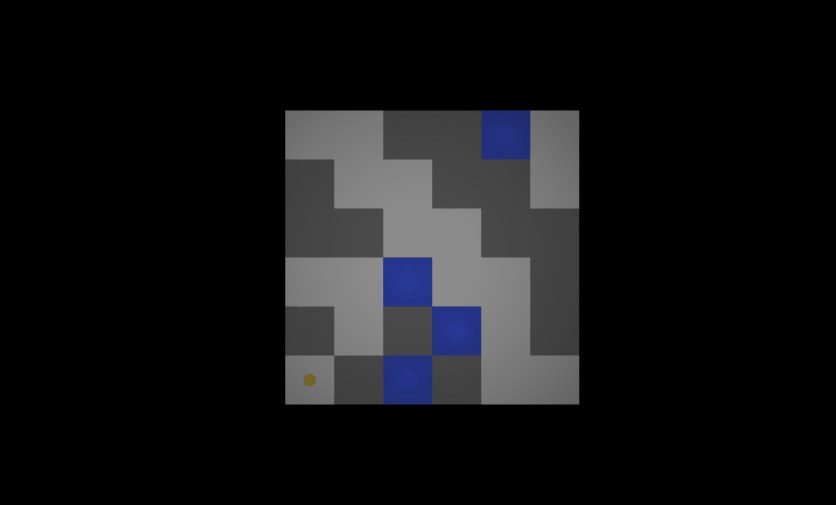

Game made for a gamejam challenge between me and my friend.

## Topic: 
Hide and seek

## Assumptions:
* fast and replayable gameplay
* challenge for memory and 3D imagination

## Flow:
1. Preparation: memorize field pattern
1. Seek: reach to the grail (yellow sphere) before your opponent

## Tags:
- InputSystem
- WaveFunctionCollapse

## Possible improvements:
* third game phase in which player who got the grail have to deliver it to a specific place, avoiding the opponent
(it should be able to predict if in specific starting conditions a player should seek the grail or focus on preparing traps)
* 3D levels (easy to achieve thanks to the WaveFunctionCollapse)
* multiplayer

